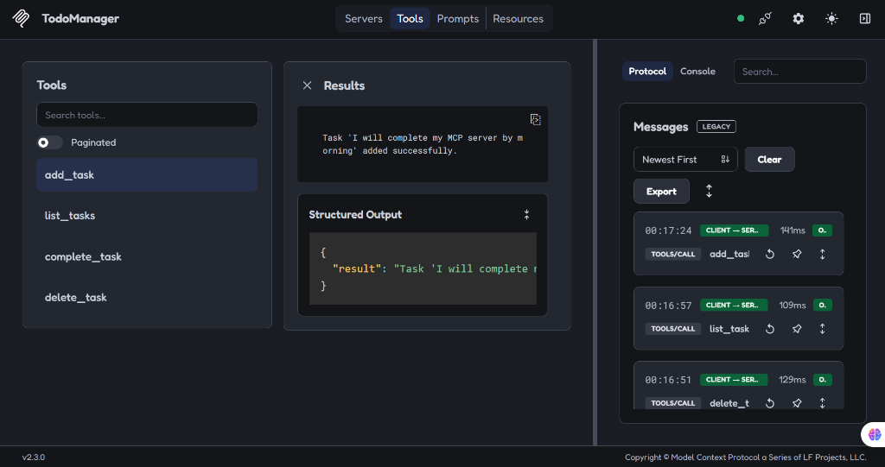
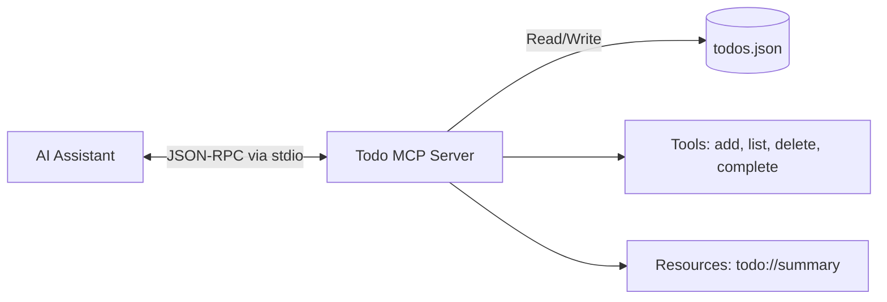

# 📝 Personal To-Do List MCP Server

[](https://www.python.org/)
[](https://modelcontextprotocol.io/)
[](LICENSE)

A minimalistic and functional Model Context Protocol (MCP) server that provides AI assistants with a robust local To-Do list manager. This server demonstrates how an AI can manage local state and interact with persistent data (CRUD operations) without requiring external APIs or complex databases.

## 🌐 Live Demo & Media
- **Live Registry Listing:** [Glama MCP Server](#) *(Pending Review)*
- **Demo Video:** *Coming soon*

## 📸 Screenshots


## ✨ Key Features
- **🤖 Native AI Integration:** Works seamlessly with Claude Desktop, Cursor, and Antigravity.
- **🛠️ Complete CRUD Operations:** Add, list, complete, and delete tasks.
- **📊 Real-time Summaries:** Provides read-only resources summarizing pending vs. completed tasks.
- **🔒 Private Local Storage:** Stores data strictly on your local machine using JSON.
- **⚙️ Zero Configuration:** Works entirely out of the box with modern Python packaging.

## 🛠️ Tech Stack Table

| Category | Technology | Purpose |
| :--- | :--- | :--- |
| **Protocol** | Model Context Protocol (MCP) | AI-to-Tool communication standard |
| **Language** | Python 3.10+ | Core logic and execution |
| **SDK** | `mcp[cli]` (FastMCP) | Official Anthropic SDK for Python |
| **Package Manager** | `pip` / `pyproject.toml` | Modern dependency management |
| **Database** | Local JSON File | Persistent local state storage |

## ⚙️ How It Works
1. **Tool Invocation:** The AI client sends a JSON-RPC request to the MCP server (e.g., `add_task`).
2. **Execution:** The Python server parses the local `todos.json` file.
3. **Modification:** The server updates the JSON file with the new task and saves it.
4. **Response:** The server returns a success confirmation back to the AI client.

## 🏗️ Project Architecture


## 📂 Project Structure
```text
├── docs/                      # Learning outcomes and documentation
│   ├── inspector.png
│   └── resend-experience.md
├── src/
│   └── todo_mcp/              # Core MCP server package
│       ├── __init__.py
│       ├── __main__.py        # Execution entrypoint
│       └── server.py          # Tools and resources logic
├── .gitignore
├── pyproject.toml             # Modern Python package configuration
└── README.md
```

## 💻 Local Setup & Installation

### Prerequisites
- Python 3.10 or higher
- Node.js (for `npx` if using the Inspector)

### Installation
Clone the repository and install it locally using `pip`:
```bash
git clone https://github.com/Arslan-Codes097/todo-list-mcp-server.git
cd todo-list-mcp-server
pip install .
```

### Running Locally (Inspector)
To test the tools in the interactive MCP Inspector UI:
```bash
npx @modelcontextprotocol/inspector python -m src.todo_mcp
```

### Connecting to an AI Client (Zero-Install)
The easiest way to use this server is via `uvx`. It will automatically download and run the server without you needing to clone the repository manually.

Add the following to your client's `config.json`:
```json
{
  "mcpServers": {
    "todo-mcp": {
      "command": "uvx",
      "args": [
        "--from",
        "git+https://github.com/Arslan-Codes097/todo-list-mcp-server.git",
        "python",
        "-m",
        "src.todo_mcp"
      ]
    }
  }
}
```

## 👤 Author & Credits
**Arslan** 
- GitHub: [@Arslan-Codes097](https://github.com/Arslan-Codes097)

*Built as a hands-on exploration of the Model Context Protocol.*
